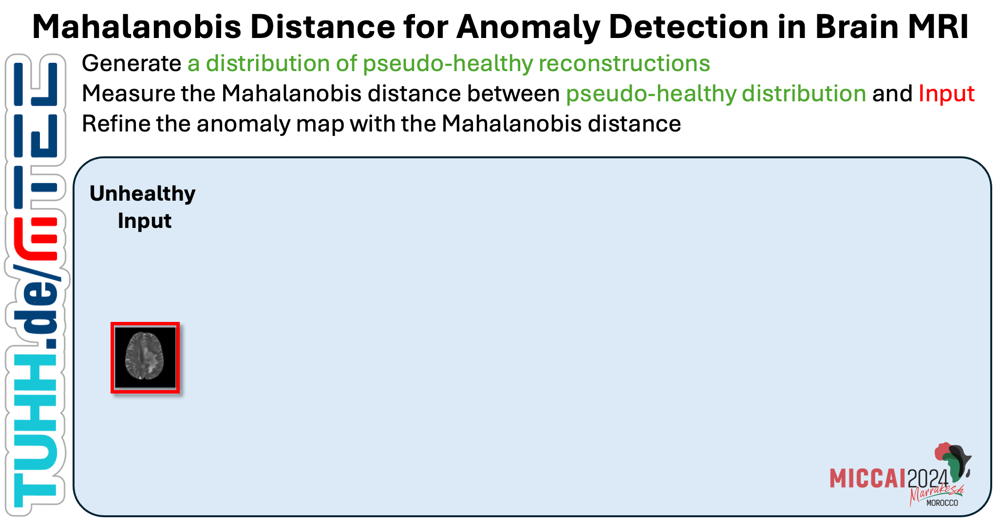

# Mahalanobis Distance for Anomaly Detection in Brain MRI
Codebase for our MICCAI 24 paper [Leveraging the Mahalanobis Distance to enhance Unsupervised Brain MRI Anomaly Detection](https://arxiv.org/abs/XXX).

**Abstract**: 
Unsupervised Anomaly Detection (UAD) methods rely on healthy data distributions to identify anomalies as outliers. In brain MRI, a common approach is reconstruction-based UAD, where generative models reconstruct healthy brain MRIs, and anomalies are detected as deviations between input and reconstruction. However, this method is sensitive to imperfect reconstructions, leading to false positives that impede the segmentation. To address this limitation, we construct multiple reconstructions with probabilistic diffusion models. We then analyze the resulting distribution of these reconstructions using the Mahalanobis distance to identify anomalies as outliers. By leveraging information about normal variations and covariance of individual pixels within this distribution, we effectively refine anomaly scoring, leading to improved segmentation. 
Our experimental results demonstrate substantial performance improvements across various data sets. Specifically, compared to relying solely on single reconstructions, our approach achieves relative improvements of 15.9%, 35.4%, 48.0%, and 4.7% in terms of AUPRC for the BRATS21, ATLAS, MSLUB and WMH data sets, respectively.

## Data
We use the IXI data set, the BraTS21, MSLUB, ATLAS_v2 and WMH data set for our experiments. 
You can download/request the data sets here:

* [IXI](https://brain-development.org/ixi-dataset/)
* [BraTS21](http://braintumorsegmentation.org/)
* [MSLUB](https://lit.fe.uni-lj.si/en/research/resources/3D-MR-MS/)
* [ATLAS v2](https://fcon_1000.projects.nitrc.org/indi/retro/atlas.html)
* [WMH](https://dataverse.nl/dataset.xhtml?persistentId=doi:10.34894/AECRSD )

After downloading and processing the directory structure of <DATA_DIR> should look like this: 

    <DATA_DIR>
    ├── Train
    │   ├── ixi
    │   │   ├── mask
    │   │   ├── t2
    │    │  └── t1
    ├── Test
    │   ├── Brats21
    │   │   ├── mask
    │   │   ├── t2
    │   │   └──seg
    │   ├── MSLUB
    │   │   ├── mask
    │   │   ├── t2
    │   │   └── seg
    │   ├── ATLAS_v2
    │   │   ├── mask
    │   │   ├── t1
    │   │   └── seg
    │   └── ...
    ├── splits
    │   ├──  Brats21_test.csv        
    │   ├──  Brats21_val.csv   
    │   ├──  MSLUB_val.csv 
    │   ├──  MSLUB_test.csv
    │   ├──  IXI_train_fold0.csv
    │   ├──  IXI_train_fold1.csv 
    │   └── ...                
    └── ...

You should then specify the location of <DATA_DIR> in the pc_environment.env file. Additionally, specify the <LOG_DIR>, where runs will be saved. 

## Environment Set-up
To download the code type 

    git clone git@github.com:FinnBehrendt/Mahalanobis-Unsupervised-Anomaly-Detection.git

In your linux terminal and switch directories via

    cd Mahalanobis-Unsupervised-Anomaly-Detection

To setup the environment with all required packages and libraries, you need to install anaconda first. 

Then, run 

    conda env create -f environment.yml -n mhd-uad

and subsequently run 

    conda activate mhd-uad
    pip install -r requirements.txt

to install all required packages.

## Run Experiments

To run the training of the cDDPM, run 

    python run.py experiment=cDDPM/DDPM_cond_spark_2D model.cfg.pretrained_encoder=False

For slightly better performance, you can pretrain the encoder via masked pretraining (Spark) 

    python run.py experiment=cDDPM/Spark_2D_pretrain

Having pretrained the encoder, you can now run 

    python run.py experiment=cDDPM/DDPM_cond_spark_2D encoder_path=<path_to_pretrained_encoder>

The <path_to_pretrained_encoder> will be placed in the <LOG_DIR>. Alternatively, you will find the best checkpoint path printed in the terminal. 
For more details of the cDDPM and training, see the original cDDPM [repo](https://github.com/FinnBehrendt/Conditioned-Diffusion-Models-UAD) and [paper](https://arxiv.org/abs/2312.04215).

Having trained the cDDPM, you can run the MHD evaluation with 
   
    python run.py experiment=MHD/cDDPM_MHD load_checkpoint=<path_to_trained_cDDPM> datamodule.cfg.mode=t2 

for T2 and

    python run.py experiment=MHD/cDDPM_MHD load_checkpoint=<path_to_trained_cDDPM> datamodule.cfg.mode=t1 
for T1 weighted scans.

